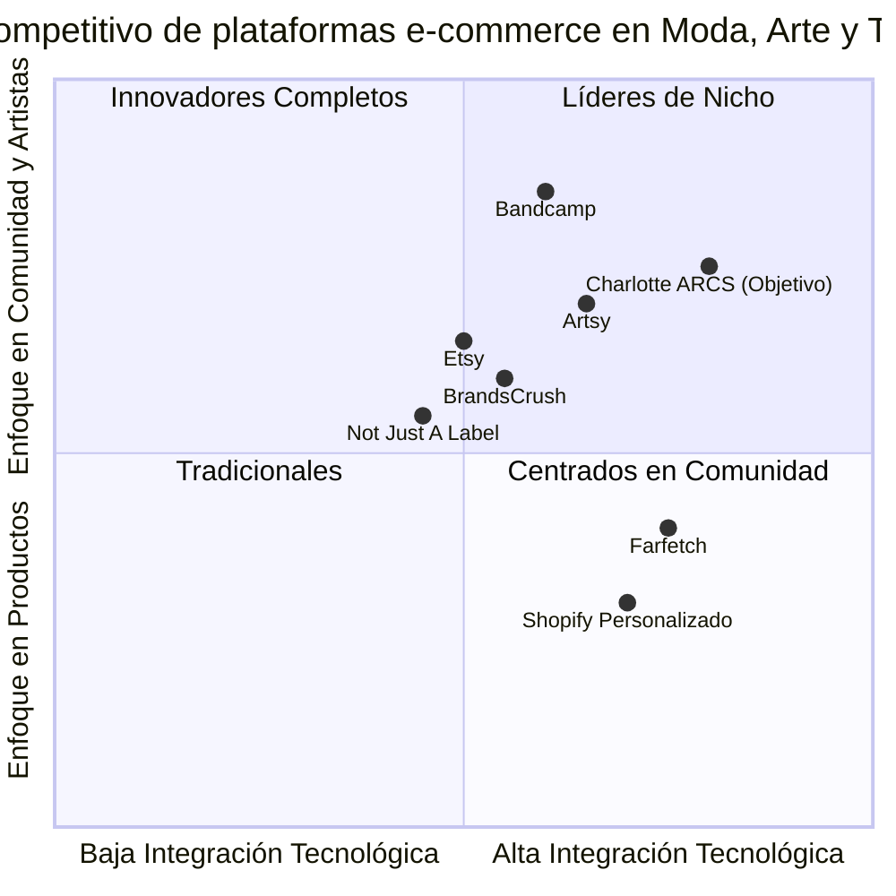

# Documento de Requisitos del Producto (PRD)
# Charlotte ARCS Tienda Online

## Idioma y Información del Proyecto

- **Idioma**: Español
- **Lenguajes de Programación**: HTML, CSS, JavaScript, PHP, Java, Python
- **Nombre del Proyecto**: charlotte_arcs_online_store
- **Fecha**: 23 de mayo de 2025

### Requisitos Originales
Crear una tienda online para Charlotte ARCS (ARCS Roses Éternelles) que fusione moda, tecnología y arte. La plataforma debe ser una solución e-commerce responsiva que maneje múltiples categorías de productos (moda, joyería, perfumería, accesorios, videojuegos) mediante dropshipping. También debe incluir una sección de artistas para votaciones y membresías. El diseño debe emplear una paleta de colores pastel y animaciones multicolores, reflejando los valores de sostenibilidad, creatividad y compasión.

## Definición del Producto

### Metas del Producto

1. **Crear una plataforma e-commerce inmersiva**: Desarrollar una tienda online que fusione moda, tecnología y arte, ofreciendo una experiencia de usuario única mediante un diseño distintivo con elementos interactivos y animados.

2. **Establecer un sistema de votación y membresía para artistas**: Implementar una sección dedicada a la promoción y votación de artistas, con diferentes niveles de membresía que ofrezcan beneficios exclusivos a los usuarios.

3. **Expandir la presencia internacional**: Posicionar a Charlotte ARCS en mercados globales, con enfoque en México y países como Ecuador, Panamá, Perú, Chile, Canadá, España, Portugal y Estonia, mediante una plataforma multilingüe con opciones de envío internacional.

### Historias de Usuario

1. **Como cliente internacional**, quiero poder navegar por categorías de productos claramente organizadas y filtrar según mis preferencias, para encontrar fácilmente artículos que se adapten a mis gustos y necesidades.

2. **Como aficionado a la música**, deseo poder votar por mis artistas favoritos y acceder a contenido exclusivo a través de membresías, para sentirme parte de la comunidad de Charlotte ARCS y apoyar a los creadores que admiro.

3. **Como comprador recurrente**, necesito un proceso de pago sencillo y seguro con múltiples opciones (Stripe, transferencias bancarias), para completar mis compras de manera eficiente y confiable.

4. **Como artista emergente**, quiero poder postularme para ser considerado como parte del roster de Charlotte ARCS, para aumentar mi visibilidad y alcanzar nuevas audiencias.

5. **Como usuario móvil**, deseo una experiencia de navegación fluida y adaptativa en mi smartphone, para poder explorar productos y realizar compras cómodamente desde cualquier lugar.

### Análisis Competitivo

| Competidor | Descripción | Pros | Contras |
|------------|-------------|------|--------|
| **Farfetch** | Plataforma global de moda de lujo | • Experiencia de usuario premium • Catálogo internacional • Herramientas de visualización avanzadas • Alcance global • Enfoque en moda de lujo | • Precios elevados • No incluye categorías como videojuegos • Sin sistema de votación para artistas • Enfoque limitado en arte y tecnología |
| **Etsy** | Marketplace para productos artesanales | • Fuerte comunidad de creadores • Énfasis en productos hechos a mano • Buen soporte para artistas • Plataforma establecida | • Interfaz menos inmersiva • Pocas animaciones interactivas • Sin integración de dropshipping • Limitada en categorías tecnológicas |
| **Bandcamp** | Plataforma para música independiente | • Sistema robusto de apoyo a artistas • Membresías para fans • Fuerte componente comunitario • Interfaz centrada en artistas | • Enfocada solo en música • Sin productos físicos de moda • Interfaz menos visual • Limitada en categorías de productos |
| **Not Just A Label** | Plataforma para diseñadores emergentes | • Enfoque en sostenibilidad • Apoyo a talentos emergentes • Estética minimalista elegante • Enfoque en historias de diseñadores | • Catálogo limitado • Sin integración multimedia completa • Pocas categorías de productos • Sin sistema de votación |
| **Shopify (implementaciones personalizadas)** | Plataforma personalizable para ecommerce | • Alta personalización • Múltiples integraciones • Soporte para varios métodos de pago • Escalabilidad | • Requiere desarrollo adicional • Costos de mantenimiento elevados • Implementaciones de arte y tecnología limitadas • Sin enfoque específico en artistas |
| **BrandsCrush** | Plataforma emergente de moda y arte | • Combina moda y arte • Diseño visual atractivo • Sistema de curaduría • Enfoque en sostenibilidad | • Alcance geográfico limitado • Sin opciones de videojuegos • Pocas herramientas para artistas • Opciones de pago limitadas |
| **Artsy** | Mercado global de arte en línea | • Enfoque principal en arte • Visualizaciones de alta calidad • Herramientas educativas • Conexión con galerías | • Sin productos de moda • Sin integración de tecnología • Interfaz menos inmersiva • Limitada a arte visual |

### Gráfico de Cuadrantes Competitivos

## Especificaciones Técnicas

### Análisis de Requisitos

La plataforma de Charlotte ARCS requiere una solución técnica que combine múltiples tecnologías para crear una experiencia de usuario única y fluida. Las principales necesidades técnicas incluyen:

1. **Frontend interactivo y visualmente atractivo**:
   - Implementación de HTML5, CSS3 con Bootstrap 5.3.3
   - JavaScript para animaciones (Sakura, Chart.js 4.4.2) y reproductor YouTube
   - Diseño responsivo con enfoque mobile-first
   - Paleta de colores pastel y animaciones multicolores

2. **Backend robusto y seguro**:
   - PHP (Laravel 11) para rutas y autenticación
   - Java (Spring Boot 3.2) para APIs
   - Python (Flask 3.0) para microservicios
   - Supabase como base de datos y backend-as-a-service

3. **Integración de pagos**:
   - Stripe para procesamiento de pagos
   - Integración con Banco Azteca para transferencias
   - Gestión de membresías de diferentes niveles

4. **Funcionalidades de e-commerce**:
   - Sistema de dropshipping con APIs de proveedores
   - Catálogo de productos por categorías
   - Carrito de compras y checkout
   - Sistema de envíos nacionales e internacionales

5. **Sección de Artistas**:
   - Sistema de votación vinculado a Supabase
   - Gráficas interactivas con Chart.js
   - Formulario de postulación
   - Gestión de membresías

### Pool de Requisitos

#### P0 (Must-have)
1. **Estructura de la tienda online con categorías definidas**
   - Implementación completa del header (50% de ancho en escritorio)
   - Páginas para cada categoría de productos (hombre, mujer, jóvenes, niños, joyería, accesorios, perfumería, videojuegos)
   - Carrito de compras funcional
   - Integración con Stripe y Banco Azteca
   - Diseño responsivo con paleta de colores definida
   - Sistema de dropshipping con al menos 3 APIs

2. **Sección de artistas**
   - Tabla de artistas con información completa
   - Sistema de votación funcional
   - Gráfica de popularidad interactiva
   - Página de postulación con formulario

3. **Aspectos técnicos esenciales**
   - Implementación de Supabase para almacenamiento de datos
   - Sistema de seguridad (HTTPS, validación CSRF)
   - Optimización para móviles y escritorio
   - Animaciones básicas (Sakura, tulipanes)

#### P1 (Should-have)
1. **Mejoras en la experiencia de usuario**
   - Implementación del reproductor YouTube flotante
   - Filtros avanzados por categoría (tipo, talla, precio)
   - Integración completa con todos los proveedores de dropshipping
   - Membresías para usuarios con beneficios
   - Optimización de carga de imágenes

2. **Funcionalidades adicionales para artistas**
   - Galería de fotos con enlaces a videos
   - Sistema de comentarios y valoraciones
   - Dashboard para artistas registrados

3. **Expansión internacional**
   - Opciones de envío internacional configuradas
   - Cálculo automático de costos de envío
   - Soporte para múltiples monedas

#### P2 (Nice-to-have)
1. **Características avanzadas**
   - Implementación de realidad aumentada para visualizar productos
   - Sistema de recomendaciones basado en IA
   - Integración con redes sociales para compartir productos y artistas
   - Chat en vivo para soporte al cliente
   - Área exclusiva para miembros premium

2. **Optimizaciones técnicas**
   - Caché avanzado para mejorar el rendimiento
   - Optimización SEO avanzada
   - Sistema de análisis de datos y comportamiento del usuario
   - Panel de administración personalizado

### Borrador de Diseño de UI

El diseño de la interfaz de usuario seguirá los siguientes lineamientos:

#### Header
- Ocupará el 50% del ancho en pantallas >768px
- Banner animado con mensaje de bienvenida en púrpura
- Menú de navegación en verde pastel (#98FB98)
- Animación de deslizamiento desde la derecha

#### Páginas de Productos
- Layout de catálogo con productos organizados en grid
- 4 columnas en escritorio, 3 en tablets, 1 en móviles
- Filtros en barra naranja (#FFA500) en la parte superior
- Botones de compra en rosa (#FFC1CC)
- Animaciones de Sakura en todas las páginas excepto index.html

#### Sección de Artistas
- Gráfica de barras multicolores para popularidad
- Tabla con información detallada de artistas
- Galería de fotos con bordes animados
- Formulario de votación y membresías

#### Footer
- Texto "Charlotte ARCS 2020©Roses Éternelles 🌸" en púrpura
- Animación de pulso
- Fondo blanco con pétalos cayendo

### Preguntas Abiertas

1. **Integración con Proveedores**:
   - ¿Se necesitarán APIs adicionales a las mencionadas para el sistema de dropshipping?
   - ¿Existen acuerdos específicos con los proveedores que afecten la implementación?

2. **Escalabilidad**:
   - ¿Cuál es el volumen de tráfico esperado a corto y medio plazo?
   - ¿Se prevé expandir a más países además de los mencionados?

3. **Contenido**:
   - ¿Quién será responsable de la creación y actualización de contenido (descripciones de productos, biografías de artistas)?
   - ¿Con qué frecuencia se actualizará el catálogo de productos?

4. **Legales**:
   - ¿Existen consideraciones legales específicas para la venta en los países objetivo?
   - ¿Se requieren adaptaciones para cumplir con normativas como GDPR?

5. **Mantenimiento**:
   - ¿Quién será responsable del mantenimiento técnico después del lanzamiento?
   - ¿Cuál es el proceso para reportar y solucionar problemas?

## Plan de Implementación

### Fase 1: Preparación y Diseño (2 semanas)

1. **Configuración del Entorno (3 días)**
   - Configuración de repositorio y entornos de desarrollo
   - Instalación de dependencias y frameworks
   - Configuración de Supabase y Stripe

2. **Diseño Detallado (4 días)**
   - Creación de wireframes y prototipos
   - Definición de componentes UI/UX
   - Diseño de animaciones y elementos visuales

3. **Arquitectura del Sistema (2 días)**
   - Diseño de la estructura de la base de datos
   - Definición de APIs y endpoints
   - Planificación de la integración de servicios

4. **Preparación de Recursos (5 días)**
   - Creación/obtención de imágenes y assets
   - Preparación de contenido inicial
   - Configuración de servicios externos

### Fase 2: Desarrollo Core (4 semanas)

1. **Frontend Básico (10 días)**
   - Implementación de estructura HTML y CSS
   - Desarrollo del header y footer
   - Implementación de páginas principales
   - Integración de Bootstrap y responsividad

2. **Backend Fundamental (8 días)**
   - Configuración de Laravel, Spring Boot y Flask
   - Implementación de autenticación
   - Desarrollo de APIs básicas
   - Integración con Supabase

3. **E-commerce Core (10 días)**
   - Implementación del catálogo de productos
   - Desarrollo del carrito de compras
   - Integración de Stripe y sistema de pagos
   - Configuración del sistema de dropshipping básico

### Fase 3: Funcionalidades Avanzadas (2 semanas)

1. **Sección de Artistas (5 días)**
   - Desarrollo de la página de artistas
   - Implementación del sistema de votación
   - Creación de gráficas con Chart.js
   - Desarrollo del formulario de postulación

2. **Animaciones y Experiencia (5 días)**
   - Implementación de Sakura y animaciones de tulipanes
   - Integración del reproductor YouTube
   - Optimización de transiciones y efectos visuales

3. **Sistema de Membresías (4 días)**
   - Desarrollo de niveles de membresía
   - Implementación de beneficios por nivel
   - Integración con el sistema de pagos

### Fase 4: Pruebas y Optimización (2 semanas)

1. **Pruebas de Funcionalidad (5 días)**
   - Testing de todas las funcionalidades core
   - Validación de integración entre sistemas
   - Pruebas de carga y rendimiento

2. **Optimización (5 días)**
   - Mejora de rendimiento y tiempos de carga
   - Optimización de imágenes y recursos
   - Implementación de caché

3. **Pruebas de Compatibilidad (4 días)**
   - Testing en múltiples navegadores
   - Validación en dispositivos móviles
   - Ajustes de responsividad

### Fase 5: Lanzamiento y Seguimiento (1 semana)

1. **Despliegue (2 días)**
   - Configuración del entorno de producción
   - Despliegue de la aplicación
   - Configuración de dominios y SSL

2. **Documentación (2 días)**
   - Creación de documentación técnica
   - Elaboración de manuales de usuario
   - Documentación de APIs y endpoints

3. **Monitorización y Soporte Inicial (3 días)**
   - Configuración de herramientas de monitorización
   - Resolución de problemas post-lanzamiento
   - Recopilación de feedback inicial

## Conclusión

La tienda online de Charlotte ARCS representa una oportunidad única para crear una plataforma que fusione moda, tecnología y arte de manera innovadora. El enfoque en sostenibilidad, creatividad y compasión, junto con el diseño distintivo y las funcionalidades especializadas, posicionarán a la marca en un nicho diferenciado frente a competidores establecidos.

La implementación técnica, aunque compleja por la combinación de múltiples tecnologías, permitirá crear una experiencia de usuario única y memorable, alineada con la visión de Carla Sánchez y ARCS Roses Éternelles en la Comunidad Phoenix de Worlds in Actech.

Siguiendo el plan de implementación propuesto y priorizando los requisitos según su criticidad, se podrá desarrollar la plataforma en aproximadamente 11 semanas, cumpliendo con todos los requerimientos técnicos, funcionales y de diseño especificados.
